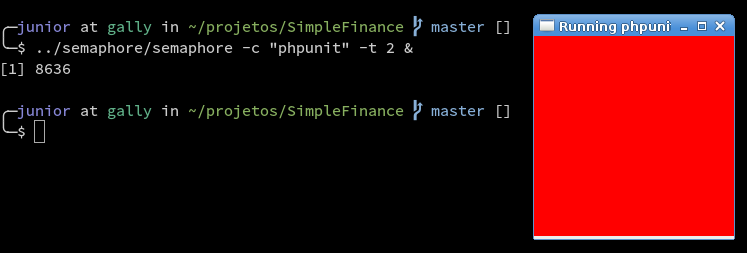
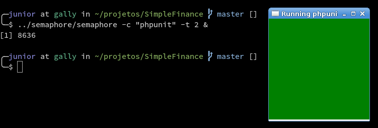

# Semaphore

Semaphore is a simple Python/Tkinter app to help monitoring status from a given
command.

I mainly use it for unit tests.

## Usage

Using semaphore is pretty simple, here are some examples:

 `semaphore -c "py.test" -t 5`

The line above will call semaphore to run py.test every 5 seconds.

For PHPUnit:

 `semaphore -c "phpunit unit" -t 2`

## Screenshots

Failing tests:

Successful tests:

have fun!
